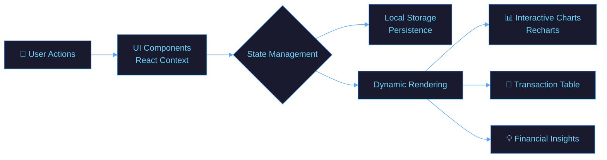

<!-- ═══════════ ANIMATED HEADER ═══════════ -->

# 💰 Finance Dashboard

<div align="center">
<!-- ═══════════ TYPING ANIMATION ═══════════ -->

<br/>

<!-- ═══════════ BADGES ═══════════ -->

&nbsp;

&nbsp;

&nbsp;


<br/>


&nbsp;

&nbsp;

&nbsp;

&nbsp;


</div>

---

## 🌊 What is Finance Dashboard?

**Finance Dashboard** is a modern, intuitive personal finance management application. Built with **React** and **Tailwind CSS**, it empowers you to track your income, monitor your expenses, and gain powerful financial insights through a beautiful UI.

Whether you're budgeting for the month, analyzing spending trends, or managing daily transactions — **Finance Dashboard** has you covered.

> *"Track. Analyze. Grow. — Take control of your financial future."*

### ✨ Core Philosophy
- 🎯 **Simplicity first** — elegant UI, zero clutter
- ⚡ **Speed** — lightning-fast performance with Vite
- 🔌 **Extensibility** — scalable React architecture and components

---

## 🚀 Features

<div align="center">

| Feature | Description | Status |
|---------|-------------|--------|
| 📊 **Advanced Analytics** | Monthly trend and spending category charts via Recharts | ✅ Active |
| 💸 **Transaction Management** | Full CRUD capabilities for tracking daily expenses and income | ✅ Active |
| 🛡️ **Role-Based Access** | Switch between Admin (Full Access) and Viewer (Read-only) | ✅ Active |
| 🌙 **Dark Mode Support** | Seamless toggle between Light and Dark themes | ✅ Active |
| 📥 **Data Export** | Download your financial data securely as CSV or JSON | ✅ Active |
| 📱 **Responsive Design** | Optimized for Desktop, Tablet, and Mobile views | ✅ Active |

</div>

---

## 🛠️ Tech Stack

<div align="center">

### 💻 Frontend Core


### 🎨 Styling & UI


### 🔧 Tools & DevOps


</div>

---

## 🗂️ Project Structure

```
📦 finance-dashboard/
├── 📁 src/
│   ├── 📁 components/      ← UI components (NavBar, Charts, Transactions)
│   ├── 📁 context/         ← Global state management (AppContext)
│   ├── 📁 utils/           ← Calculation and formatting helpers
│   ├── 📁 data/            ← Mock transaction data
│   └── 📄 App.jsx          ← Root component and routing
├── 📄 package.json         ← Project dependencies and scripts
├── 📄 tailwind.config.js   ← Tailwind CSS configuration
└── 📄 vite.config.js       ← Vite bundler configuration
```

---

## ⚙️ Architecture Overview



---

## 🚦 Quick Start

### Prerequisites

```bash
# Make sure you have Node.js installed (v18+ recommended)
node --version

# You can use npm or yarn
npm --version
```

### 🖥️ Run Locally

```bash
# 1. Clone the repository
git clone https://github.com/Umangpandey75/finance-dashboard.git

# 2. Navigate to the project directory
cd finance-dashboard

# 3. Install dependencies
npm install

# 4. Start the development server
npm run dev
```

---

## 🎮 How to Use

<div align="center">

```
  Step 1             Step 2              Step 3              Step 4
     🌐                 📝                  📊                  📥
Open Dashboard  → Add Transaction  → Analyze Spending  →  Export Data
  Home Page        Fill the Form     View the Charts     CSV or JSON
```

</div>

### 🔑 Key Interactions

| Action | Description |
|---------|--------|
| **Add Transaction** | Admin role: click 'Add' and log income/expense |
| **Switch Role** | Toggle between Admin & Viewer in the Navbar |
| **Toggle Theme** | Switch Dark/Light mode using the Sun/Moon icon |
| **Filter Data** | Use search or month filters in the Transactions view |
| **Export** | Download all records directly to your local machine |

---

## 📸 Interface Preview

<div align="center">

> 🌙 **Dark-themed financial UI** — minimalist, clean, and focused on data

```
┌──────────────────────────────────────────┐
│                                          │
│   💰 Finance Dashboard      [🌙] [👤]  │
│                                          │
│   ┌────────────┐ ┌────────────┐          │
│   │ 💼 Balance │ │ 📉 Expense │          │
│   │   $4,200   │ │   $1,100   │          │
│   └────────────┘ └────────────┘          │
│                                          │
│          [ 📊  Spending Chart ]          │
│                                          │
│   Recent Transactions:                   │
│   🟢 Salary          +$3000              │
│   🔴 Groceries       -$150               │
│                                          │
└──────────────────────────────────────────┘
```

**Background:** `#1a1a2e` &nbsp;|&nbsp; **Card:** `#16213e` &nbsp;|&nbsp; **Text:** `#ffffff`

</div>

---

## 🤝 Contributing

Contributions are what make the open-source community amazing! Here's how you can help:

```bash
# 1. Fork the repository on GitHub
# 2. Create your feature branch
git checkout -b feature/AmazingFeature

# 3. Commit your changes
git commit -m '✨ Add AmazingFeature'

# 4. Push to the branch
git push origin feature/AmazingFeature

# 5. Open a Pull Request 🎉
```

### 💡 Ideas for Contribution
- [ ] 🌍 Multi-currency support
- [ ] 📈 Additional advanced chart types
- [ ] 🔌 Backend integration (Node.js/Express)
- [ ] 🔐 User authentication (Firebase/Auth0)
- [ ] 📅 Recurring transactions system

---

## 📜 License

Distributed under the **MIT License**. See `LICENSE` for more information.

---

## 👨‍💻 Author

<div align="center">

### **Umang Pandey**
*Frontend Developer · React Enthusiast · UI/UX Designer*

[](mailto:umangpandey.co@gmail.com)
&nbsp;
[](https://linkedin.com/in/umang-pandey-01b486273)
&nbsp;
[](https://github.com/Umangpandey75)
&nbsp;
[](https://umangpandey.vercel.app)

*"Query the data. Build the insight. Ship the WOW. ✨"*

</div>

---

## ⭐ Show Your Support

If **Finance Dashboard** helped you manage your finances better, please give it a ⭐ — it means the world!

<div align="center">

[](https://github.com/Umangpandey75/finance-dashboard/stargazers)
&nbsp;
[](https://github.com/Umangpandey75/finance-dashboard/fork)
&nbsp;
[](https://twitter.com/intent/tweet?text=Check+out+Finance-Dashboard+by+%40Umangpandey75!+%F0%9F%92%B0%F0%9F%93%88&url=https://github.com/Umangpandey75/finance-dashboard)

</div>
---
<!-- ═══════════ FOOTER WAVE ═══════════ -->


<div align="center">

*Made with ❤️ by [Umang Pandey](https://github.com/Umangpandey75) · © 2026 Finance Dashboard*


</div>
